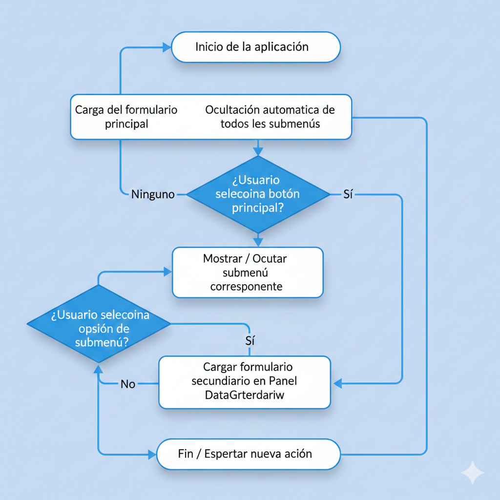



# Documentación Técnica – ReData

---

## 1. Portada 

**Nombre de la aplicación:** ReData  
**Práctica:** A34 – Generación de Interfaces Gráficas de Usuario  
**Módulo:** Desarrollo de Interfaces  
**Curso:** 2º DAM  
**Profesor:** Camilo Juan Casillas  
**Alumno:** Carlos Cosa  
**Centro:** IES POETA PACO MOLLA  
**Fecha:** 20 de febrero de 2026  
**Versión de la aplicación:** 1.0  

---

### Descripción breve

ReData es una aplicación de escritorio desarrollada en Windows Forms (.NET) 
que permite gestionar información de clientes, productos y compras mediante una 
interfaz gráfica con menús dinámicos y conexión a base de datos MySQL y API REST.

## 2. Introducción

### 2.1 Descripción general

ReData es una aplicación de escritorio desarrollada en Windows Forms utilizando .NET.  
Su objetivo principal es gestionar información relacionada con clientes, productos y compras mediante una interfaz gráfica organizada con menús y submenús dinámicos.

La aplicación permite:

- Mostrar y gestionar datos almacenados en una base de datos MySQL.
- Visualizar información en tablas mediante el control DataGridView.
- Cargar formularios secundarios dentro de un panel contenedor dinámico.
- Ocultar y mostrar submenús mediante programación.
- Conectarse a una API REST externa utilizando HttpClient.
- Realizar peticiones HTTP GET y POST.
- Deserializar datos JSON usando System.Text.Json.

El diseño de la interfaz está basado en un menú lateral con botones principales (Productos, Clientes y Compras), cuyos submenús se muestran u ocultan dinámicamente.  
La información seleccionada se carga en un panel contenedor derecho, permitiendo mantener una interfaz organizada y modular.

---

### 2.2 Audiencia objetivo

La aplicación está dirigida a los siguientes perfiles:

- **Usuarios finales:** Personas que necesiten consultar o gestionar información de clientes, productos o compras.
- **Administradores:** Encargados de supervisar los datos almacenados en la base de datos.
- **Desarrolladores:** Programadores que deseen mantener, ampliar o mejorar la aplicación.
- **Estudiantes de desarrollo:** Como ejemplo práctico de uso de Windows Forms, conexión a bases de datos y consumo de APIs REST.

---

### 2.3 Alcance

**ReData permite:**

- Gestionar datos almacenados en una base de datos MySQL.
- Visualizar registros en un DataGridView.
- Integrar datos externos mediante consumo de API REST.
- Organizar la interfaz mediante paneles dinámicos.
- Implementar control de errores en peticiones HTTP y deserialización JSON.

**Problemas que resuelve:**

- Desorganización en la gestión de datos.
- Falta de estructura en interfaces gráficas.
- Dificultad para integrar datos locales con datos externos.
- Gestión manual poco eficiente.

La aplicación está orientada a fines educativos y demuestra la integración de múltiples tecnologías dentro de una aplicación de escritorio.

---

### 2.4 Requisitos previos

Antes de instalar o ejecutar la aplicación es necesario:

- Sistema operativo Windows 10 o superior.
- Tener instalado .NET (versión utilizada en el proyecto).
- Tener configurado un servidor MySQL con la base de datos correspondiente.
- Conexión a Internet para utilizar la funcionalidad de API REST.
- Permisos de administrador para la instalación.

## 4. Uso de la aplicación

### 4.1 Diagrama de flujo

El funcionamiento general de la aplicación sigue el siguiente flujo:

### 4.2 Interfaz de usuario

La aplicación está compuesta por los siguientes elementos principales:

#### 1. Formulario principal

Contiene:

- Panel lateral izquierdo (menú principal).
- Panel contenedor derecho (panelContenedor).
- Submenús desplegables.

El panel lateral incluye los siguientes botones principales:

- Productos
- Clientes
- Compras

Cada botón principal muestra u oculta un submenú asociado mediante métodos programados en el formulario.

---

#### 2. Submenús dinámicos

Los submenús están contenidos en paneles independientes que se ocultan al iniciar la aplicación.

Se utiliza un método para:

- Ocultar todos los submenús al iniciar.
- Mostrar el submenú seleccionado.
- Ocultar automáticamente el submenú si ya estaba visible.

Esto permite mantener una interfaz limpia y organizada.

---

#### 3. Panel contenedor (panelContenedor)

El panelContenedor ocupa la parte derecha del formulario principal y tiene la propiedad Dock en Fill.

Su función es:

- Cargar formularios secundarios.
- Mostrar la información correspondiente a la opción seleccionada.
- Mantener la estructura modular de la aplicación.

---

#### 4. Formularios secundarios

Cada opción del submenú carga un formulario secundario dentro del panelContenedor.

Estos formularios pueden contener:

- Label descriptivo.
- DataGridView para mostrar datos.
- Botones de acción.

### 4.3 Guías paso a paso

#### Mostrar el listado de clientes desde la base de datos

1. Iniciar la aplicación.
2. Pulsar el botón principal "Clientes".
3. Seleccionar la opción "Listado Clientes".
4. El sistema cargará el formulario correspondiente dentro del panelContenedor.
5. Los datos se mostrarán en un DataGridView conectado a la base de datos MySQL.

#### Cargar datos desde la API REST

1. Pulsar la opción correspondiente a "Clientes API".
2. El sistema realizará una petición HTTP GET usando HttpClient.
3. Se deserializarán los datos JSON recibidos.
4. Los datos se mostrarán automáticamente en el DataGridView.

#### Enviar datos mediante petición POST

1. Pulsar el botón correspondiente al envío de datos.
2. Se generará un objeto con la información a enviar.
3. Se serializará a formato JSON.
4. Se enviará mediante HttpClient con método POST.
5. Se mostrará la respuesta del servidor.

## 5. Mantenimiento

El mantenimiento de la aplicación ReData es fundamental para garantizar su correcto funcionamiento, especialmente en lo relacionado con la base de datos MySQL gestionada mediante XAMPP y el consumo de la API REST.

---

### 5.1 Cómo generar copias de seguridad

La aplicación utiliza MySQL a través de XAMPP, por lo que las copias de seguridad deben realizarse desde phpMyAdmin o mediante exportación directa de la base de datos.

#### Método recomendado (phpMyAdmin en XAMPP)

1. Abrir el Panel de Control de XAMPP.
2. Iniciar los servicios de **Apache** y **MySQL**.
3. Pulsar en el botón "Admin" de MySQL (abre phpMyAdmin).
4. Seleccionar la base de datos utilizada por ReData.
5. Ir a la pestaña "Exportar".
6. Seleccionar el método "Rápido".
7. Elegir formato SQL.
8. Pulsar "Continuar".

Se descargará un archivo `.sql` que contiene toda la estructura y datos de la base de datos.

Este archivo debe guardarse en una ubicación segura.

---

#### Restaurar una copia de seguridad

1. Iniciar Apache y MySQL desde XAMPP.
2. Abrir phpMyAdmin.
3. Crear una base de datos nueva (si es necesario).
4. Ir a la pestaña "Importar".
5. Seleccionar el archivo `.sql` guardado.
6. Pulsar "Continuar".

La base de datos quedará restaurada.

---

### 5.2 Solución de problemas

A continuación se describen posibles incidencias y sus soluciones.

---

#### Problema: No se muestran datos en el DataGridView

Posibles causas:

- MySQL no está iniciado en XAMPP.
- Error en la cadena de conexión.
- La base de datos no contiene registros.

Solución:

- Verificar que el servicio MySQL esté activo en XAMPP.
- Revisar usuario, contraseña y nombre de la base de datos en la cadena de conexión.
- Comprobar que existen registros en las tablas.

---

#### Problema: Error de conexión a MySQL

**Posibles causas:**

- Puerto incorrecto.
- Usuario o contraseña incorrectos.
- Base de datos inexistente.

**Solución:**

- Verificar que el puerto 3306 esté activo.
- Comprobar credenciales configuradas en el proyecto.
- Confirmar que la base de datos existe en phpMyAdmin.

---

#### Problema: Error al consumir la API REST

**Posibles causas:**

- No hay conexión a Internet.
- URL incorrecta.
- Error en la deserialización del JSON.

**Solución:**

- Comprobar conexión de red.
- Verificar la URL utilizada en el código.
- Revisar la clase modelo usada para deserializar.

## 6. Errores comunes

En esta sección se detallan los errores más frecuentes que pueden ocurrir al usar ReData y cómo solucionarlos.

---

### 6.1 Lista de errores frecuentes

| Error | Causa | Solución |
|-------|-------|----------|
| **DataGridView vacío** | MySQL no iniciado o tabla sin datos | Iniciar MySQL en XAMPP, verificar tablas y registros |
| **Error de conexión a MySQL** | Usuario, contraseña o puerto incorrecto | Revisar cadena de conexión en el código, puerto 3306 activo |
| **Excepción HttpRequestException** | URL API incorrecta o no hay Internet | Verificar URL, comprobar conexión de red |
| **Error JsonException** | Deserialización de JSON incorrecta | Revisar clase modelo utilizada en `JsonSerializer` |
| **Formulario secundario no se carga** | Panel contenedor incorrecto o formulario no asignado | Comprobar que se pasa correctamente el formulario al método de carga |
| **Submenú no se oculta/mostrar correctamente** | Panel mal nombrado o método de ocultar no llamado | Revisar nombres de los paneles y que se ejecuta el método de ocultar submenús |

---

### 6.2 FAQ (Preguntas frecuentes)

**P1: Necesito Internet para usar ReData**  
- Solo para las opciones que consumen datos de la API REST.  
- La gestión de datos locales en MySQL funciona sin conexión.

**P2: Puedo usar la aplicación en otro equipo**  
- Sí, siempre que tengas XAMPP instalado y la base de datos configurada.

**P3: Qué pasa si la base de datos se corrompe**  
- Restaurar la copia de seguridad realizada mediante phpMyAdmin.

**P4: Puedo modificar los nombres de los botones o paneles**  
- Sí, pero recuerda actualizar los nombres en el código para que los métodos sigan funcionando.

**P5: Qué versión de MySQL es compatible**  
- Se recomienda MySQL 5.7 o superior con XAMPP.

## 7. Actualizaciones y cambios

### 7.1 Historial de versiones

Actualmente, ReData cuenta con **una única versión estable**:

| Versión | Fecha | Cambios principales |
|---------|-------|-------------------|
| 1.0 (final) | (Fecha de la versión final) | - Aplicación completa con menú principal y submenús dinámicos. - Panel contenedor para cargar formularios secundarios. - Conexión a base de datos MySQL mediante XAMPP. - Consumo de API REST con `HttpClient`. - Visualización de datos en DataGridView. - Métodos de ocultar/mostrar submenús implementados. - Manejo de errores HTTP y deserialización JSON. - Proyecto subido a GitHub: [ReData GitHub](https://github.com/CarlosCosa-Prog/DI/tree/main/UD3/Act4_Ud3) |

---

### 7.2 Instrucciones de actualización

Dado que solo existe la **versión final**, no se requiere migración desde versiones anteriores.  
Si en el futuro se publican nuevas versiones, el procedimiento sería:

1. Descargar la nueva versión desde el repositorio GitHub o el instalador correspondiente.
2. Realizar copia de seguridad de la base de datos existente mediante phpMyAdmin.
3. Reemplazar los archivos de la versión anterior por los de la nueva versión.
4. Ejecutar la aplicación y verificar el correcto funcionamiento.

## 9. Contacto y soporte

En caso de incidencias o dudas sobre el uso de la aplicación ReData, los usuarios pueden contactar con el equipo de soporte de la siguiente manera.

---

### 9.1 Soporte técnico

**Correo electrónico:** carcossan@alu.edu.gva.es  
**Tipo de soporte:** Soporte vía correo electrónico para consultas técnicas relacionadas con la aplicación.  
**Alcance:** Consultas sobre instalación, uso de la aplicación, problemas con la base de datos MySQL o consumo de API REST.

---

### 9.2 Política de soporte

- **Horario de atención:** Lunes a viernes, de 9:00 a 18:00.  
- **Tiempo de respuesta:** 24 a 48 horas hábiles.  
- **Niveles de soporte:**
  - **Nivel 1:** Consultas generales sobre funcionamiento de la aplicación.
  - **Nivel 2:** Problemas técnicos relacionados con la base de datos MySQL o conexión a la API REST.
  - **Nivel 3:** Errores críticos de la aplicación que requieran revisión del código.

> Nota: Se recomienda incluir toda la información posible sobre el error (captura de pantalla, pasos realizados) para agilizar la resolución.

## 10. Glosario

A continuación se presentan definiciones de términos técnicos y específicos utilizados en la aplicación ReData:

- **CRUD:** Acrónimo de **Crear, Leer, Actualizar y Eliminar**. Conjunto de operaciones básicas para gestionar datos en bases de datos.

- **DataGridView:** Control de Windows Forms que permite mostrar datos tabulares en filas y columnas, con opciones de edición y visualización.

- **API REST:** Interfaz de programación que permite la comunicación entre aplicaciones a través de peticiones HTTP (GET, POST, PUT, DELETE).  
  ReData utiliza una API REST externa para obtener y enviar datos de clientes.

- **HttpClient:** Clase de .NET utilizada para realizar peticiones HTTP de manera asíncrona. Permite enviar y recibir datos desde APIs REST.

- **JSON (JavaScript Object Notation):** Formato de texto ligero para intercambiar datos estructurados. Se utiliza en ReData para enviar y recibir información de la API REST.

- **Panel contenedor (panelContenedor):** Panel dentro del formulario principal donde se cargan los formularios secundarios de manera dinámica.

- **Submenú dinámico:** Paneles que contienen opciones específicas de cada botón principal (Productos, Clientes, Compras) y que se muestran u ocultan mediante programación.

- **XAMPP:** Entorno de desarrollo que incluye Apache, MySQL, PHP y Perl. Se utiliza para ejecutar la base de datos MySQL de ReData de manera local.

- **Deserialización:** Proceso de convertir datos en formato JSON a objetos de C# para poder trabajar con ellos en la aplicación.

- **Dock:** Propiedad de los controles de Windows Forms que permite anclarlos a un borde del formulario o panel (por ejemplo, `Dock=Fill` para ocupar todo el espacio disponible).

## 11. Licencia y términos de uso

### 11.1 Licencia

ReData es una aplicación desarrollada con fines educativos dentro del marco del curso de 2º DAM.  
La licencia aplicable es la siguiente:

- **Uso personal y educativo:** Permitido.  
- **Distribución comercial:** Prohibida.  
- **Modificación del código:** Permitida únicamente para fines educativos o de aprendizaje, citando al autor original.  
- **Autor:** Carlos Cosa  
- **Repositorio público:** [ReData GitHub](https://github.com/CarlosCosa-Prog/DI/tree/main/UD3/Act4_Ud3)

---

### 11.2 Términos de uso

- La aplicación se proporciona **tal cual**, sin garantía de funcionamiento en todos los entornos.  
- El usuario es responsable de realizar copias de seguridad de sus datos antes de realizar cualquier cambio.  
- No se permite la redistribución de la aplicación con fines comerciales sin autorización expresa del autor.  
- El uso de ReData implica la aceptación de estos términos.

---

> Nota: Esta licencia está diseñada para proteger la autoría y garantizar que la aplicación se utilice únicamente con fines educativos.
